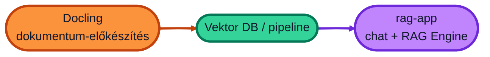

# AI a céges dokumentációban - RAG alapok kezdőknek

Kiegészítő segédlet a Mentor Klub "AI a céges dokumentációban - RAG alapok kezdőknek" című képzéséhez.

## Vektor adatbázis

Egy helyileg futtatható, chroma alapú vektor adatbázis, amely lehetővé teszi a dokumentumok gyors és hatékony keresését vektoralapú lekérdezések segítségével.

Ehhez találsz két példás is: [vectordb/chroma](vectordb/chroma/README.md)

## Docling

A Docling egy eszköz, amely segít a dokumentumok vektoralapú adatbázisok számára történő előkészítésében.

Ehhez itt találsz segédletet: [docling](docling/README.md)

## RAG pipeline bemutatása

A `rag-pipeline` mappa tartalmaz különböző típusú fájlokat, amelyeket bármilyen RAG rendszerbe betölthetünk. 
Előtte azonban azokat át kell alakítanunk a RAG számára értelmezhwtő és kezelhető formátumra.
A Doclong segítségével ezeket a fájlokat könnyen átalakíthatjuk.

**[rag-pipeline](rag-pipeline)**

## RAG chat alkalmazás (3-rétegű)

A `rag-app` mappa egy teljes chat alkalmazás: böngészős felület, FastAPI backend, Gemini (Agent Platform) és a korábban beállított RAG Engine.

Helyben (Mac / Windows / Linux) és Cloud Run-on is futtatható. Részletes, kezdőknek szóló telepítés:

**[rag-app/README.md](rag-app/README.md)**
