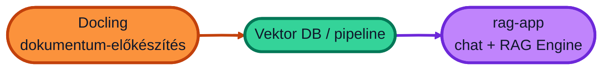

# AI a céges dokumentációban - RAG alapok kezdőknek

Kiegészítő segédlet a Mentor Klub "AI a céges dokumentációban - RAG alapok kezdőknek" című képzéséhez.

```mermaid
%%{init: {"theme": "base", "themeVariables": {"fontSize": "16px", "lineColor": "#334155"}, "flowchart": {"curve": "basis", "padding": 12}}}%%
flowchart LR
  A(["Docling<br/>dokumentum-előkészítés"]) --> B(["Vektor DB / pipeline"])
  B --> C(["rag-app<br/>chat + RAG Engine"])

  classDef prep fill:#fb923c,stroke:#c2410c,stroke-width:3px,color:#0f172a
  classDef store fill:#34d399,stroke:#047857,stroke-width:3px,color:#0f172a
  classDef app fill:#c084fc,stroke:#6d28d9,stroke-width:3px,color:#0f172a

  class A prep
  class B store
  class C app

  linkStyle 0 stroke:#c2410c,stroke-width:3px
  linkStyle 1 stroke:#6d28d9,stroke-width:3px
```

## Vektor adatbázis

Egy helyileg futtatható, chroma alapú vektor adatbázis, amely lehetővé teszi a dokumentumok gyors és hatékony keresését vektoralapú lekérdezések segítségével.

Ehhez találsz két példás is: [vectordb/chroma](vectordb/chroma/README.md)

## Docling

A Docling egy eszköz, amely segít a dokumentumok vektoralapú adatbázisok számára történő előkészítésében.

Ehhez itt találsz segédletet: [docling](docling/README.md)

## RAG pipeline bemutatása

A `rag-pipeline` mappa tartalmaz különböző típusú fájlokat, amelyeket bármilyen RAG rendszerbe betölthetünk.
Előtte azonban azokat át kell alakítanunk a RAG számára értelmezhető és kezelhető formátumra.
A Doclong segítségével ezeket a fájlokat könnyen átalakíthatjuk.

**[rag-pipeline](rag-pipeline)**

## RAG előkészítése GCP-ben

### Fájlok feltöltése GCP-be

Miután átalakítottuk a dokumentumokat a RAG számára megfelelő formátumra, feltölthetjük őket egy Cloud Storage Bucket-be. Ezt az alábbi módon tehetjük meg:

1. Nyissuk meg böngészőben a [Google Cloud Console](https://console.cloud.google.com/) oldalt és válasszuk ki a megfelelő projektet.
2. Navigáljunk a **Cloud Storage** szekcióhoz.
3. Hozzunk létre egy új bucket-et. Legyen ennek neve most `aurora-dynamics-docs`.
4. Location type legyen **Region** és azon belül válasszuk ki a **europe-west4**.
5. A többi beállítást hagyjuk alapértelmezett értéken.
6. Töltsük fel a RAG számára előkészített dokumentumokat a bucket-be.

### RAG Engine beállítása

A dokumentumok feltöltésre kerültek a Cloud Storage bucket-be, most a RAG Engine-ben létre kell hozni egy corpus-t, amely a bucket tartalmára hivatkozik. Ezt a következő lépésekben tehetjük meg:

1. Nyissuk meg a RAG Engine (Agent Platform → Agents → RAG Engine) oldalt.
2. Régió legyen **europe-west4**.
3. Majd kattintsunk a **Create corpus** gombra.
4. Corpus name: `aurora-dynamics-docs`
5. Data: itt válasszuk a Cloud Storage bucket nevét (`aurora-dynamics-docs`).
6. Kattintsunk a **Continue** gombra.
7. Embedding model modell legyen a **Text Multilingual Embedding 002**.
8. Vector database legyen: **RagManaged Cloud Spanner**.
9. Kattintsunk a **Create corpus** gombra.
10. Mentés után a RAG Engine indexeli a dokumentumokat (5-10 perc), és készen áll a keresésre.

_Fogalom: A Spanner egy globálisan elosztott, erősen konzisztens adatbázis-szolgáltatás a Google Cloud Platformon, amely lehetővé teszi a nagy mennyiségű adat hatékony kezelését és a gyors lekérdezéseket. Ennek van vektor alapú keresési képessége is._

### Tesztelés

A RAG Engine beállítása után érdemes ellenőrizni, hogy a dokumentumok megfelelően indexelődtek-e, és a keresés működik-e.
1. Nyissuk meg a RAG Engine (Agent Platform → Agents → RAG Engine) oldalt.
2. Válasszuk ki a korábban létrehozott corpus-t (`aurora-dynamics-docs`).
3. Kattintsunk a **Test** linkre. Ez lehetőséget ad az Agent Studion belül a dokumentumokban való keresésre.
4. Ellenőrizzük, hogy a találatok relevánsak és pontosak-e.

## RAG chat alkalmazás (3-rétegű)

A `rag-app` mappa egy teljes chat alkalmazás: böngészős felület, FastAPI backend, Gemini (Agent Platform) és a korábban beállított RAG Engine.

Helyben (Mac / Windows / Linux) és Cloud Run-on is futtatható. Részletes, kezdőknek szóló telepítés:

**[rag-app/README.md](rag-app/README.md)**
