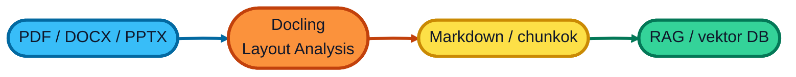

# Docling

Docling egy eszköz, amely segít a dokumentumok vektoralapú adatbázisok számára történő előkészítésében. A Docling egy új generációs, nyílt forráskódú megoldás, ami nem csak kiolvassa a szöveget a fájlokból, hanem látja és érti is az oldalak szerkezetét (Layout Analysis).

## Kész eszköz

Itt találsz egy előre elkészített eszközt, amivel Te is könnyedén konvertálhatod a dokumentumaidat vektoralapú adatbázisok számára megfelelő formátumba.

[CloudMentor RAG Converter](https://github.com/cloudsteak/docling-rag-converter.git)

## További hasznos linkek:

- [Docling cikk](https://cloudmentor.hu/docling-igy-keszits-tokeletes-adatot-barmilyen-rag-hez/)
- [Docling hivatalos oldal](https://docling.ai)
