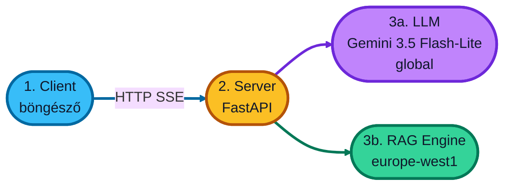

# rag-app — 3-rétegű céges dokumentum-chat

Ez egy **képzésre szánt** alkalmazás. A cél a kevés, átlátható kód, nem a production-szintű hibakezelés.

A felhasználó bejelentkezés nélkül chatelhet. A válaszokat a Google Cloud **Gemini** modellje adja. Opcionálisan a **RAG Engine** a korábban feltöltött céges dokumentumokból keres, és a modell ezekre támaszkodik.

A chat üzenetek **streamelve** jönnek: a válasz szóról szóra jelenik meg, ahogy a modell írja.



| Réteg | Hol fut | Mi a feladata |
| --- | --- | --- |
| **1. client** | A te gépeden, vagy Cloud Run | Chat felület. Nincs belépés. RAG ki/be, „Hívások” panel. |
| **2. server** | A te gépeden, vagy Cloud Run | Összeköti a clientet az LLM-mel és a RAG-gal. |
| **3a. LLM** | Google Agent Platform | `gemini-3.5-flash-lite` (globális modell). |
| **3b. RAG** | Google RAG Engine | A **már létező**, kézzel beállított corpus. |

Alapértelmezett régió: **europe-west1**.  
Helyi bejelentkezés: **ADC** (Application Default Credentials) — lásd lent.

---

## Tartalomjegyzék

1. [Amit erről a laborról tudni kell](#1-amit-erről-a-laborról-tudni-kell)
2. [Fogalmak két percben](#2-fogalmak-két-percben)
3. [Eszközök telepítése](#3-eszközök-telepítése)
4. [Google Cloud projekt](#4-google-cloud-projekt)
5. [A kód letöltése](#5-a-kód-letöltése)
6. [A `.env` fájl kitöltése](#6-a-env-fájl-kitöltése)
7. [Helyi Google-bejelentkezés (ADC)](#7-helyi-google-bejelentkezés-adc)
8. [GCP előkészítés (service account, API-k)](#8-gcp-előkészítés-service-account-api-k)
9. [Futtatás a saját gépen](#9-futtatás-a-saját-gépen)
10. [Cloud Run a Console-ban](#10-cloud-run-a-console-ban)
11. [Minden törlése](#11-minden-törlése)
12. [Hogyan működik a kód](#12-hogyan-működik-a-kód)
13. [Ha valami nem megy](#13-ha-valami-nem-megy)

---

## 1. Amit erről a laborról tudni kell

- A **RAG corpust nem ez az app hozza létre.** A képzésen azt már kézzel beállítottátok. Ide csak a corpus **teljes nevét** kell beírni.
- A clientnek **nincs jelszava**. Aki ismeri a Cloud Run URL-t, az chatelhet. Ez demóra való, nyilvános céges adatra ne tedd.
- A `gemini-3.5-flash-lite` **globális** modell: a Cloud Run `europe-west1`-ben van, a modellhívás `global` végpontra megy. Ez így van kitalálva.
- A Cloud Run szolgáltatást **a Console-ban** hozod létre: Overview → **Connect repository**, a Create service lapon **Cloud Build** (nem a Developer Connect). Git push → új image → új verzió. A kódban csak `Dockerfile` van, `cloudbuild.yaml` szándékosan nincs.
- Mac-en, Windows-on és Linuxon is megy. A bemutató Mac-en készült.

---

## 2. Fogalmak két percben

**Google Cloud projekt**  
Egy „munkaterület”, aminek van azonosítója (project ID), számlázása, és benne vannak a szolgáltatások. Minden parancs egy projektre vonatkozik.

**Régió (`europe-west1`)**  
Földrajzi hely, ahol a Cloud Run és a RAG Engine fut (Belgium). A modell ettől függetlenül `global`.

**ADC (Application Default Credentials)**  
Helyben a programok nem egy jelszavas kulcsfájlt használnak, hanem a `gcloud auth application-default login` után a gépen maradó belépést. Cloud Run-on ugyanezt a **service account** helyettesíti.

**Cloud Run**  
Google-ös „tedd ide a konténert, mi futtatjuk HTTPS-en”. Két szolgáltatás lesz: `rag-app-client` és `rag-app-server`. A Console-ban hozod létre őket.

**Cloud Build**  
A Cloud Run létrehozásakor a Console összeköti a GitHub repót a szolgáltatással. Push után a Build a `Dockerfile` alapján image-et készít, a Run pedig új verziót indít. Külön `cloudbuild.yaml` nem kell.

**Service account**  
Nem ember, hanem egy technikai felhasználó. A server ezzel hívja az LLM-et és a RAG-ot.

**RAG Engine / Rag Corpus**  
A Google által hosztolt tudástár. A dokumentumok már benne vannak. A server csak keres benne (`retrieve_contexts`).

**uv**  
Python csomagkezelő. A `pip` + virtuális környezet helyett egy parancs: `uv sync`, `uv run`.

**SSE (Server-Sent Events)**  
A server folyamatosan küld sorokat a böngészőnek (`event: token`, `event: debug`). Ettől „gépelődik” a válasz.

---

## 3. Eszközök telepítése

Mindegyik gépen kell:

1. **Python 3.12** (vagy újabb 3.x, de 3.12 a beállított)
2. **uv**
3. **Google Cloud CLI (`gcloud`)**
4. (opcionális) **Docker Desktop**, ha konténerben akarod helyben futtatni
5. **Git**

### Mac

1. Telepítsd a [Homebrew](https://brew.sh)-t, ha még nincs (a weboldal ad egy `install` parancsot, azt másold a Terminalba).
2. Terminalban:

```bash
brew install python@3.12 git
brew install --cask google-cloud-sdk
curl -LsSf https://astral.sh/uv/install.sh | sh
```

3. Zárd be a Terminalt, nyisd újra, és ellenőrizd:

```bash
python3 --version
uv --version
gcloud --version
```

Docker (opcionális): [Docker Desktop for Mac](https://www.docker.com/products/docker-desktop/).

### Windows

1. [Python 3.12](https://www.python.org/downloads/) — a telepítőn pipáld be: **Add python.exe to PATH**.
2. [Git for Windows](https://git-scm.com/download/win).
3. [Google Cloud CLI](https://cloud.google.com/sdk/docs/install) — Windows telepítő.
4. uv PowerShellben:

```powershell
powershell -ExecutionPolicy Bypass -c "irm https://astral.sh/uv/install.ps1 | iex"
```

5. Zárd be a PowerShellt, nyisd újra:

```powershell
python --version
uv --version
gcloud --version
```

Ha a `.ps1` scriptek tiltva vannak:

```powershell
Set-ExecutionPolicy -Scope CurrentUser RemoteSigned
```

vagy futtasd így: `powershell -ExecutionPolicy Bypass -File .\scripts\run-local.ps1`

Docker (opcionális): [Docker Desktop for Windows](https://www.docker.com/products/docker-desktop/). WSL2-t a telepítő felajánlja, fogadd el.

### Linux

```bash
# Példa Debian/Ubuntu. A Python 3.12 a disztribúciótól függhet.
sudo apt update
sudo apt install -y python3 python3-venv git
curl -LsSf https://astral.sh/uv/install.sh | sh
```

`gcloud`: a hivatalos leírás a [Google Cloud SDK install](https://cloud.google.com/sdk/docs/install) oldalon. Docker: a disztribúciód csomagja vagy Docker Desktop.

---

## 4. Google Cloud projekt

Ha még soha nem használtál Google Cloudot:

1. Nyiss egy Google-fiókot.
2. Menj a [Google Cloud Console](https://console.cloud.google.com/) oldalra.
3. Hozz létre egy **projektet** (fent a projektválasztó → New Project). Jegyezd fel a **Project ID**-t (ez nem mindig ugyanaz, mint a megjelenített név).
4. Kapcsold be a **számlázást** (Billing). A Gemini / Cloud Run használata pénzbe kerül; a képzéses kvóta mellett is kell billing account.
5. Ezt a projektet fogjuk használni. A RAG corpusnak **ugyanebben** a projektben kell lennie.

A saját gépeden egyszer jelentkezz be a `gcloud`-ba:

```bash
gcloud init
```

Ez megkérdezi a fiókot és a projektet. Válaszd ki ugyanazt a Project ID-t.

---

## 5. A kód letöltése

```bash
git clone https://github.com/cloudmentor/trn-gcp-ai-rag.git
cd trn-gcp-ai-rag/rag-app
```

Windows PowerShellben ugyanez a `git clone` + `cd`.

A további parancsok **ebből a `rag-app` mappából** értendők, hacsak mást nem írunk.

---

## 6. A `.env` fájl kitöltése

A `.env` a saját gépedre szóló beállítás. Nincs benne jelszó, de a projektazonosítód igen, ezért gitbe ne tedd (a `.gitignore` kiszűri).

**Mac / Linux**

```bash
cp .env.example .env
```

**Windows**

```powershell
copy .env.example .env
```

Nyisd meg a `.env` fájlt bármilyen szövegszerkesztővel. Minimum ezt a kettőt cseréld ki:

```
GOOGLE_CLOUD_PROJECT=az-igazi-project-id
RAG_CORPUS=projects/az-igazi-project-id/locations/europe-west1/ragCorpora/A_CORPUS_ID
```

### Hol van a RAG corpus neve?

1. [Google Cloud Console](https://console.cloud.google.com/)
2. Keresőbe: **RAG Engine** vagy **Vertex AI** → RAG.
3. Nyisd meg a corpust, amit a képzésen létrehoztatok.
4. A teljes erőforrásnév így néz ki:

```
projects/PROJEKT_ID/locations/europe-west1/ragCorpora/1234567890
```

Másold be **egy sorba**, szóköz nélkül.

A többi érték hagyható:

| Változó | Alapértelmezés | Jelentés |
| --- | --- | --- |
| `GOOGLE_CLOUD_LOCATION` | `europe-west1` | Cloud Run + RAG régió |
| `LLM_LOCATION` | `global` | A Flash-Lite modell végpontja |
| `LLM_MODEL` | `gemini-3.5-flash-lite` | Modellnév |
| `RAG_TOP_K` | `10` | Hány dokumentumrészletet kérünk a vektoros keresésből |
| `RAG_RANKER` | `semantic-ranker-default@latest` | A találatok újrasúlyozása a kérdéshez |
| `API_URL` | `http://localhost:8080` | Helyi client → server |

---

## 7. Helyi Google-bejelentkezés (ADC)

A server **helyben** a te Google-felhasználóddal hívja az Agent Platformot. Ehhez ADC kell.

```bash
gcloud auth application-default login
gcloud auth application-default set-quota-project "$(grep '^GOOGLE_CLOUD_PROJECT=' .env | cut -d= -f2)"
```

A második parancs **után kötelező a projekt ID** (a `.env` `GOOGLE_CLOUD_PROJECT` sora). Üresen futtatva ezt írnád: `argument QUOTA_PROJECT_ID: Must be specified.`

Megnyílik a böngésző. Lépj be **azzal a Google-fiókkal**, aki a projekt tagja (Owner / Editor / `roles/aiplatform.user`). Az ADC és a `gcloud auth login` két külön belépés: ha a böngészőben másik fiókot választasz, a quota-project beállítás elhasal.

A `run-local` scriptek ezt ellenőrzik, és ha hiányzik, ők is elindítják.

Cloud Run-on **nincs ADC a te gépedről**: ott a `rag-app-server` service account dolgozik.

---

## 8. GCP előkészítés (service account, API-k)

Ezt futtasd **az első Cloud Run előtt**, és **akkor is újra**, ha hiányzik egy jog (pl. ranker 403). Ami megvan, azt kihagyja; ami hiányzik, azt berakja.

A script bekapcsolja az API-kat, létrehozza a két service accountot, kiosztja az IAM szerepeket (köztük a `roles/discoveryengine.viewer` ranker jogot). Saját Artifact Registry tárat **nem** hoz létre: a Console Cloud Build a sajátját használja.

**Mac / Linux**

```bash
chmod +x scripts/*.sh
./scripts/setup-gcp.sh
```

**Windows**

```powershell
.\scripts\setup-gcp.ps1
```

Létrejön:

| Service account | Szerep |
| --- | --- |
| `rag-app-server` | Cloud Run server. Gemini + RAG (`roles/aiplatform.user`) és a ranker (`roles/discoveryengine.viewer`). |
| `rag-app-client` | Cloud Run client (statikus web). |

Külön `rag-app-build` SA **nincs**: a Console Cloud Build a projekt **alap** Cloud Build / Compute Engine service accountját használja. A script ezeknek ad jogot a image buildhez és a Cloud Run frissítéshez.

---

## 9. Futtatás a saját gépen

A képzésen **először itt** próbálod ki a chatet. A client a **http://localhost:3000**, a server a **http://localhost:8080** címen lesz. A böngészőben a **3000**-es címet nyisd meg.

### 9.1 Docker nélkül (ezt használjuk a Mac-es bemutatón)

**Mac / Linux**

```bash
./scripts/run-local.sh
```

**Windows**

```powershell
.\scripts\run-local.ps1
```

Ez:

1. ellenőrzi az ADC-t,
2. `uv sync`-cel felteszi a Python csomagokat,
3. elindítja a FastAPI servert,
4. egy egyszerű Python webserverrel kiszolgálja a client HTML-t.

Állítsd le: **Ctrl+C**.

### 9.2 Docker Compose-szal

Előtte legyen elindítva a Docker Desktop.

**Mac / Linux**

```bash
./scripts/run-local-docker.sh
```

**Windows**

```powershell
.\scripts\run-local-docker.ps1
```

A konténer a gép ADC mappáját olvassa (Mac/Linux: `~/.config/gcloud`, Windows: `%APPDATA%\gcloud`).

### Mit látsz a felületen

- Írj egy kérdést, Enter vagy **Küldés**.
- **RAG** kapcsoló: be = a server előbb a RAG Engine-t hívja, aztán a modellt a megtalált szövegekkel. Ki = csak a modell, dokumentumok nélkül.
- **Hívások** kapcsoló: külön panelen JSON-ban látszik a backend, a RAG és az LLM kérése/válasza. Ezt kapcsold be a képzésen.

Próbakérdés (ha a cafeteria szabályzat bent van a corpusban): *„Hány cafeteria pont jár egy belépőnek?”*

Ha megy helyben, jöhet a Cloud Run. A **localhostot itt abbahagyod**: a server innentől a GCP-n fut.

---

## 10. Cloud Run a Console-ban

Előfeltétel: 6–8. lépés kész, a kód **fent van GitHubon** (a Console onnan buildel, nem a laptopodról).

A képzésen **nem** a `deploy.sh` a lényeg. Console → **Cloud Run**. Üres projektben nincs **Create service** gomb: **Connect repository** (GitHub ikon). A **Deploy container**t ne használd. A következő képernyő címe már **Create service**.

Ott:

1. **Continuously deploy from a repository (source or function)**
2. Alatta **Cloud Build** — ez **nem** az alapértelmezett (gyakran a Developer Connect van kiválasztva). Válts Cloud Buildre.
3. **Set up with Cloud Build**

Nincs `cloudbuild.yaml`.

Sorrend: **először a server**, mert a clientnek kell a server URL-je (`API_URL`).

Ha a `rag-app-server` már **Ready** a Cloud Runon, **ne** tesztelj tovább a localhoston. A következő lépés a **client** szolgáltatás.

A két szolgáltatás **Allow public access**: bejelentkezés nélkül hívható. Ez a labor része.

Első alkalommal a build 3–8 perc is lehet.

### 10.1 Server (`rag-app-server`)

1. Console → **Cloud Run** (Overview). Kattints: **Connect repository**.
2. A **Create service** képernyőn válaszd: **Continuously deploy from a repository (source or function)**.
3. Alatta **ne** a Developer Connect maradjon: válaszd a **Cloud Build**et, majd **Set up with Cloud Build**.
4. Csatlakoztasd a **GitHub** repót (ha a Cloud Build GitHub app még nincs fent, a varázsló végigvisz). Branch: pl. `main`.
5. **Build type**: Dockerfile — **ne** Cloud Build configuration file.
6. Dockerfile path: `/rag-app/server/Dockerfile`
7. A szolgáltatás **felső** része:

| Mező | Érték |
| --- | --- |
| Service name | `rag-app-server` |
| Region | `europe-west1` |
| Authentication | Allow public access |
| Auto scaling | minimum `0`, maximum `10` |

8. Görgess a **Containers, Networking, Security** blokkhoz.

**Containers** fül (a három fő fül egyike; ez van elöl)

| Mező | Alapértelmezett | Mit csinálj |
| --- | --- | --- |
| Container port | `8080` | Hagyd. A `Dockerfile` is 8080-at használ. |
| Request timeout | `300` sec | Hagyd. |
| Maximum connections | `80` | Hagyd. |

Ezen a Containers fülön **belül** két alsó fül van:

**Containers → Settings**

| Mező | Alapértelmezett | Server |
| --- | --- | --- |
| CPU | `1` | Hagyd `1`. |
| Memory | `512 MiB` | Válts **`1 GiB`**-re. |

**Containers → Variables & Secrets**

Itt add meg a környezeti változókat (ugyanazok, mint a `.env`-ben):

| Név | Honnan |
| --- | --- |
| `GOOGLE_CLOUD_PROJECT` | a projekt ID |
| `GOOGLE_CLOUD_LOCATION` | `europe-west1` |
| `LLM_LOCATION` | `global` |
| `LLM_MODEL` | pl. `gemini-3.5-flash-lite` |
| `RAG_CORPUS` | a corpus teljes erőforrásneve |
| `RAG_TOP_K` | pl. `10` |
| `RAG_RANKER` | `semantic-ranker-default@latest` |

**Security** fül (a Containers mellett, nem alatta)

Runtime service account: `rag-app-server@PROJEKT_ID.iam.gserviceaccount.com`

**Networking:** ne nyúlj hozzá.

9. **Create**. Várd meg, amíg a Build lefut és a szolgáltatás **Ready**.
10. A szolgáltatás tetején másold ki az URL-t (`https://rag-app-server-….run.app`) — ez kell a clientnek. Innentől a chat nem a localhoston megy.

### 10.2 Client (`rag-app-client`)

Ugyanaz a varázsló, másik mappa és env. Ha az Overview-n még ott a **Connect repository**, azt nyomd; ha már van szolgáltatásod, Cloud Run → **Services** → **Create service**. Itt is: repository + **Cloud Build** (nem Developer Connect). Dockerfile path: `/rag-app/client/Dockerfile`.

Fent a lapon:

| Mező | Érték |
| --- | --- |
| Service name | `rag-app-client` |
| Region | `europe-west1` |
| Authentication | Allow public access |
| Auto scaling | minimum `0`, maximum `10` |

**Containers, Networking, Security** — ugyanaz a szerkezet, mint a servernél.

**Containers** fül: Container port `8080`, Request timeout `300` sec, Maximum connections `80` — mind alap, hagyd.

**Containers → Settings:** CPU `1`, Memory `512 MiB` — ez az alap, a clientnek elég.

**Containers → Variables & Secrets:** `API_URL` = a **server** Cloud Run URL-je (a Console a server szolgáltatás tetején mutatja), **slash nélkül** a végén.

**Security** fül: Runtime service account `rag-app-client@PROJEKT_ID.iam.gserviceaccount.com`

**Networking:** ne nyúlj hozzá.

Ha a client **Ready**, a Console a client URL-jét is mutatja. **Ezt** nyisd meg / oszd meg. (A server URL a böngészőbe nem kell — azt már az `API_URL` viszi.)

### Mit látsz a felületen

- Írj egy kérdést, Enter vagy **Küldés**.
- **RAG** kapcsoló: be = a server előbb a RAG Engine-t hívja, aztán a modellt a megtalált szövegekkel. Ki = csak a modell, dokumentumok nélkül.
- **Hívások** kapcsoló: külön panelen JSON-ban látszik a backend, a RAG és az LLM kérése/válasza. Ezt kapcsold be a képzésen.

Próbakérdés (ha a cafeteria szabályzat bent van a corpusban): *„Hány cafeteria pont jár egy belépőnek?”*

Git push a kiválasztott branchre → Cloud Build újraépít → Cloud Run új verzió. A trigger a szolgáltatás mellett jön létre, nem kell külön a Cloud Build → Triggers oldalon kézzel felvenni.

### 10.3 Opcionális: parancssorból

Ha nem a Console-t akarod, a script ugyanazt a két szolgáltatást `gcloud run deploy --source`-szal rakja fel (a Cloud Buildet a `gcloud` hívja).

**Mac / Linux:** `./scripts/deploy.sh`  
**Windows:** `.\scripts\deploy.ps1`

---

## 11. Minden törlése

Ez törli a két Cloud Run szolgáltatást és a két runtime service accountot (`rag-app-server`, `rag-app-client`). A Console Cloud Build saját image-tárát nem.

**Nem törli:** a Google Cloud projektet, a bekapcsolt API-kat, a számlázást, a **kézzel létrehozott RAG corpust**, és a Console által felvett **Cloud Build triggereket**. A triggereket: Console → Cloud Build → Triggers.

**Mac / Linux**

```bash
./scripts/teardown-gcp.sh
```

**Windows**

```powershell
.\scripts\teardown-gcp.ps1
```

---

## 12. Hogyan működik a kód

Keveset kell olvasni. Kezdd itt:

```
rag-app/
  client/          ← 1. réteg (HTML + CSS + JS, nincs npm)
  server/          ← 2. réteg (FastAPI, Python)
  scripts/         ← setup / helyi futtatás / opcionális CLI deploy / teardown
  .env.example     ← ezt másolod .env-re
```

### Client (`client/app.js`)

1. A `config.js` megmondja a server URL-t.
2. Küldéskor `POST /chat` JSON-nal: `message`, `history`, `use_rag`.
3. A válasz SSE: `debug` események a jobb oldali panelre, `token` események a chatbuborékba. A releváns források címkére kattintva a `GET /source` betölti a `gs://` fájlt.
4. A `.md` dokumentumokat a `markdown.js` HTML-lé alakítja (címsor, lista, kód, táblázat). Más fájlok sima szövegként jelennek meg.

### Server (`server/main.py`)

Olvasd felülről lefelé, a kommentek magyarul vannak.

1. `POST /chat` megérkezik.
2. Debug: „a client üzenete megérkezett”.
3. Ha `use_rag=true`: `rag_client.rag.retrieve_contexts(...)` a meglévő corpuson.
4. A megtalált szövegeket a server **beleírja** a modellnek szánt promptba. Így a Hívások panelen pontosan látod, mit kapott az LLM.
5. `llm_client.chats.create(...).send_message_stream(...)` — `enterprise=True`, modell `gemini-3.5-flash-lite`, location `global`.
6. Minden token megy a böngészőnek.

Két Google-kliens van, szándékosan:

```python
llm_client = genai.Client(enterprise=True, project=..., location="global")
rag_client = agentplatform.Client(project=..., location="europe-west1")
```

A modell globális, a RAG Engine regionális.

### Dockerfile-ok

- `server/Dockerfile` — Python 3.12 + `uv sync` + uvicorn. A Cloud Run a `PORT` változót adja.
- `client/Dockerfile` — nginx, 8080-as port. Induláskor a `docker-entrypoint.sh` az `API_URL` env-ből megírja a `config.js`-t, hogy a böngésző tudja a server címét.

---

## 13. Ha valami nem megy

**`GOOGLE_CLOUD_PROJECT még nincs kitöltve`**  
A `.env` a `rag-app` mappában van? Nem az example-t szerkeszted?

**ADC / `Reauthentication is needed` / 401**  
Újra: `gcloud auth application-default login`, aztán a quota-project a `.env` szerinti ID-val.

**`set-quota-project` / `Must be specified`**  
A parancs után ott kell legyen a projekt ID. Példa:  
`gcloud auth application-default set-quota-project "$(grep '^GOOGLE_CLOUD_PROJECT=' .env | cut -d= -f2)"`

**`set-quota-project` / `serviceusage.services.use`**  
Az ADC-ben lévő Google-fiók nem tagja ennek a projektnek, vagy a projekt ID hibás.

1. A Console-ban a **Project ID**-t másold (nem a megjelenített nevet). Ellenőrzés: `gcloud projects list`
2. Nézd meg, melyik fiók van belépve: `gcloud auth list` — a `*` a `gcloud` fiókja. Az ADC ettől független.
3. Jelentkezz be **ugyanazzal** a fiókkal ADC-re is:

```bash
gcloud auth application-default login
gcloud auth application-default set-quota-project "$(grep '^GOOGLE_CLOUD_PROJECT=' .env | cut -d= -f2)"
```

4. Ha a jó fiókkal vagy bent, de még mindig ez a hiba, add oda a jogot (Owner fiókkal):

```bash
gcloud projects add-iam-policy-binding "$GOOGLE_CLOUD_PROJECT" \
  --member="user:A_TE_GOOGLE_CIME" \
  --role="roles/serviceusage.serviceUsageConsumer"
```

**`403` a dokumentum megnyitásakor**  
A server olvassa a `gs://` fájlt. Helyben az ADC-s fióknak, Cloud Run-on a `rag-app-server` SA-nak kell `roles/storage.objectViewer` (vagy Owner). Futtasd újra: `./scripts/setup-gcp.sh`

**`403` / `PermissionDenied` az LLM-en, a RAG-on vagy a rankeren**  
Helyben a **felhasználódnak** kell `roles/aiplatform.user` (vagy Owner). Cloud Run-on a `rag-app-server` SA-nak kell `roles/aiplatform.user` **és** `roles/discoveryengine.viewer` (a `semantic-ranker` miatt). Futtasd újra a `setup-gcp` scriptet, vagy:

```bash
gcloud projects add-iam-policy-binding "$GOOGLE_CLOUD_PROJECT" \
  --member="serviceAccount:rag-app-server@${GOOGLE_CLOUD_PROJECT}.iam.gserviceaccount.com" \
  --role="roles/discoveryengine.viewer"
```

Utána a chatet küldd újra — Cloud Run újratelepítés nem kell.

**`429` / `RESOURCE_EXHAUSTED`**  
Nem kódhiba: a projekt **kvótája vagy a modell kapacitása** betelt. Gyakori új projektnél és az újabb Flash modelleknél (`gemini-3.8-flash`).

1. Várj 30–60 másodpercet, ne spamelj Küldést.
2. Képzésre tedd vissza: `LLM_MODEL=gemini-3.5-flash-lite` a `.env`-ben, indítsd újra a servert.
3. Console → **IAM & Admin** → **Quotas** → kereső: `generate_content` vagy a modell neve. Ha 0, kérj Quota Increase-t, vagy válts Lite modellre.
4. A ranker (`discoveryengine`) külön kvótát eszik. Ideiglenesen: `RAG_RANKER=` (üres) a `.env`-ben.

**RAG üres / 0 chunk**  
A `RAG_CORPUS` teljes név, ugyanaz a projekt, a corpusban vannak fájlok, a kérdés hasonlít a dokumentumok nyelvére (magyar szabályzat → magyar kérdés).

**A modell azt mondja, nincs a dokumentumban, pedig benne van**  
A vektoros keresés a „hasonló” szöveget hozza, nem feltétlenül a definíciós bekezdést (pl. a Webhook szó egy példakérdésben). A server ezért rankert használ. Kapcsold be a **Hívások** panelt: ha a definíció nincs a `chunks` között, a corpus darabolása túl kicsi, vagy a fájl nincs a corpusban. Ha benne van a chunks-ban, de a modell mégsem használja, indítsd újra a servert, hogy az új promptot olvassa.

A rankerhez kell a Discovery Engine API (egyszer):

```bash
gcloud services enable discoveryengine.googleapis.com
```

**A client „nem sikerült elérni a servert”**  
Helyben fusson a 8080-as server. Cloud Run-on a client `API_URL` a server **https** URL-je legyen, slash nélkül a végén.

**Cloud Run Overview: nincs Create service**  
Üres projektben **Connect repository** a belépő (nem Deploy container). A Create service a következő oldal.

**Cloud Build helyett Developer Connect van bepipálva**  
A Create service lapon a Cloud Build **nem** az alapértelmezett. Válts **Cloud Build**re, aztán **Set up with Cloud Build**.

**GitHub nem jelenik meg**  
A Cloud Build GitHub appot a projektnek engedélyezni kell. A kód legyen fent a kiválasztott branchen.

**Windows: `uv` / `gcloud` nem parancs**  
Új PowerShell ablak a telepítés után. PATH.

**Docker: ADC a konténerben**  
Előbb a gépen működjön a `gcloud auth application-default login`. Windows-on a Docker Desktopnak joga kell a `%APPDATA%\gcloud` mappához.

**Számla / quota**  
Vertex / Agent Platform API be van kapcsolva? (`setup-gcp` megteszi.) Billing account rá van kötve a projektre?

**A válasz beragad / `Hiba: ...` a chatben**  
Kapcsold be a **Hívások** panelt. Az `error` esemény a Google üzenetét mutatja.

**A Hívások panelen / a terminálban `ExperimentalWarning` jelenik meg**  
A RAG Engine Python SDK experimental. A server ezt a figyelmeztetést elnyeli; ha mégis látod, nem hiba.

---

## Scriptek gyorslistája

| Mac / Linux | Windows | Mit csinál |
| --- | --- | --- |
| `./scripts/setup-gcp.sh` | `.\scripts\setup-gcp.ps1` | API, SA, IAM — újra futtatható, a hiányzókat pótolja |
| `./scripts/run-local.sh` | `.\scripts\run-local.ps1` | Helyi client + server |
| `./scripts/run-local-docker.sh` | `.\scripts\run-local-docker.ps1` | Ugyanez Dockerben |
| `./scripts/deploy.sh` | `.\scripts\deploy.ps1` | Opcionális CLI deploy (a képzésen a Console a lényeg) |
| `./scripts/teardown-gcp.sh` | `.\scripts\teardown-gcp.ps1` | Labor erőforrásainak törlése |
