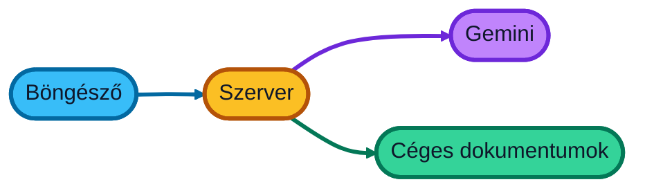
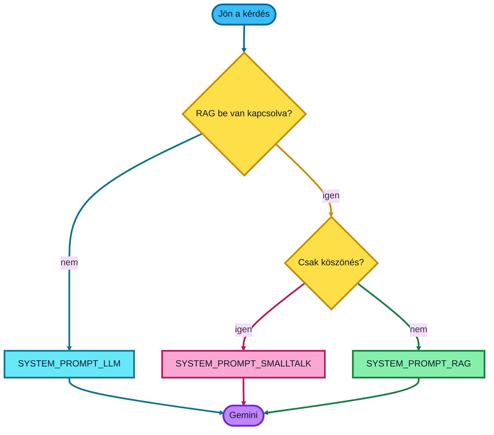
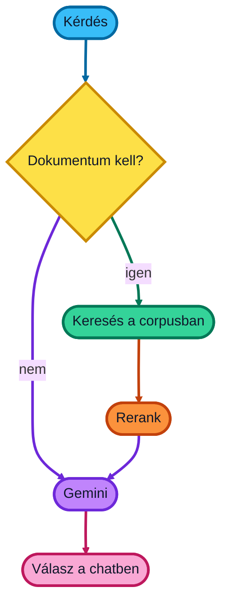
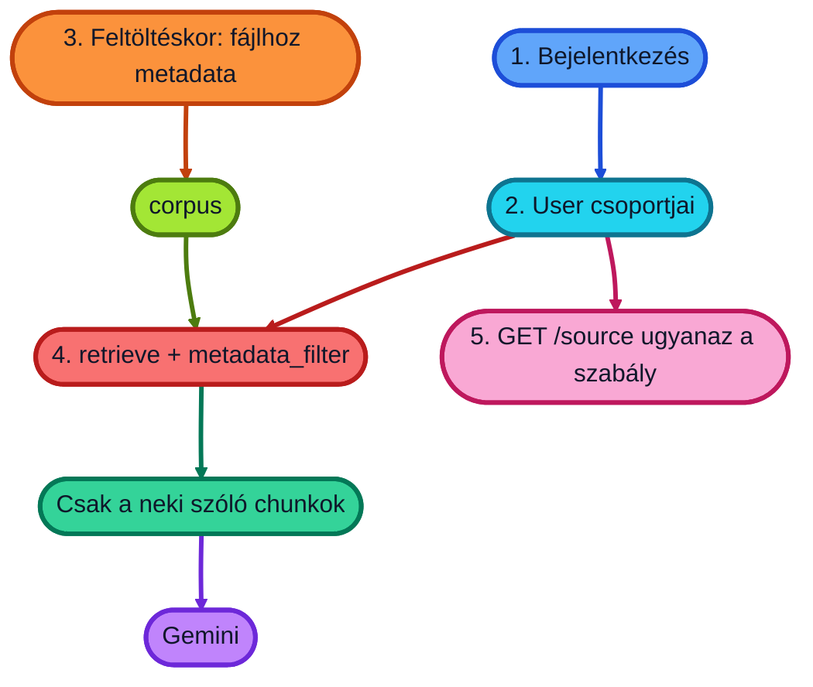

# Kiemelt — 5 perc

A labor lépései a [README.md](README.md)-ben vannak. Itt csak az, amiről beszélni érdemes.

---

## 1. Miből áll az app

Három darab. A chat a böngészőben van. A szabályok és a Google-hívások a szerveren. A Google adja a választ, és — ha kell — a céges dokumentumokból keres.

A böngészőben lévő kódot bárki átírhatja. Ezért az utasítások a modellnek a szerveren vannak, a [`main.py`](server/main.py) elején. Onnan a támadó nem cserélheti ki őket.

A böngésző csak a kérdést küldi. A szerver dönti el, mit kap a modell.

---

## 2. Promptok

A prompt = amit a modellnek mondunk, mielőtt válaszol.

Három van, mind a [`server/main.py`](server/main.py) elején. A szerver [itt választ](server/main.py#L459-L465) közülük egyet.

| Prompt | Hol | Mikor | Mit mond |
| --- | --- | --- | --- |
| `SYSTEM_PROMPT_RAG` | [55–62](server/main.py#L55-L62) | Dokumentumkérdés | Olvasd el a kapott részleteket. Magyarul, röviden. |
| `SYSTEM_PROMPT_LLM` | [71–77](server/main.py#L71-L77) | RAG ki | Nincs céges doksi. Általános tudásból válaszolj. |
| `SYSTEM_PROMPT_SMALLTALK` | [64–69](server/main.py#L64-L69) | Köszönöm, szia, oké | Egy-két mondat. Ne keress dokumentumot. |

RAG-nál a talált szöveget a szerver [hozzáírja a kérdéshez](server/main.py#L310-L327). A modell csak ezt látja, nem a teljes irattárat.

---

## 3. Két Google-hívás

Először keresés (ha kell), aztán a modell.

**Keresés** (`retrieve_contexts`): a kérdéshez hasonló bekezdéseket hoz a feltöltött fájlokból. Kb. 10 darabot.

**Rerank** (ugyanebben a hívásban, a keresés után): ezeket a darabokat **újrasorrendezi**, hogy elöl legyen, ami tényleg válasz. A sima keresés gyakran címsort vagy példakérdést talál, nem a magyarázatot.

**Gemini**: megkapja az utasítást + a kérdést + a részleteket, és ír.

A rerank az LLM **előtt** van. Ha a jó bekezdés be se került a találatokba, a modell nem tudja kitalálni.

---

## 4. Jogosultság dokumentumonként

Ma a corpus **egyben** nyitott: a szerver minden fájlt kereshet. A GCP IAM a corpusra vonatkozik, nem a `hr-szabaly.md`-re. Dokumentumszintű ACL-t a RAG Engine **fájl-metadatájával** lehet megcsinálni.

1. **Identitás.** IAP vagy céges belépés a client elé. A szerver tudja: email, csoportok (`hr`, `it`, …).
2. **Séma a corpuson.** `RagDataSchema`, pl. `audience` (`STRING`) vagy `groups` (`LIST`). Enélkül a szűrő nem értelmezhető.
3. **Metadata minden fájlra.** Feltöltés után `RagMetadata` a `RagFile`-ra: HR-szabályzat → `audience = "hr"`, mindenkinek szóló → `"all"`.
4. **Szűrés kereséskor**, ne utána. A mai [`retrieve()`](server/main.py#L140-L168) `top_k` + ranker. Mellé: `rag_retrieval_config.filter.metadata_filter` (CEL), pl.  
   `audience == "all" || audience == "hr"`  
   Amit a filter kizár, az **be sem kerül** a promptba.
5. **A [`GET /source`](server/main.py#L346-L360) ugyanez.** Ma bármelyik `gs://` URI-t kiadja. ACL nélkül a chat szűrt, a „forrás megnyitása” nem.

A promptba írt „ne idézz HR-t” nem ACL. Ami bekerült a modell elé, azt kiadhatja.
