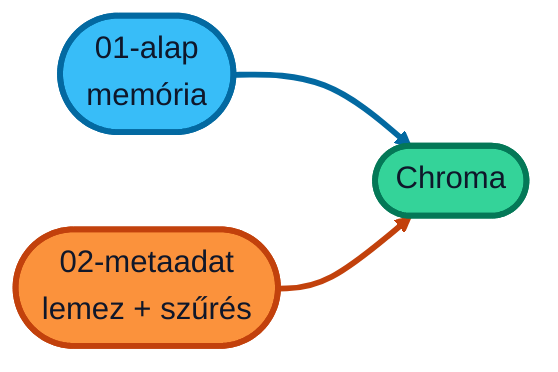

# Chroma vektor adatbázis

Két példa:

1. Egyszerű példa a Chroma vektor adatbázis használatára. [01-alap](01-alap/README.md)
2. Metaadattal kiegészített példa a Chroma vektor adatbázis használatára. [02-metaadat](02-metaadat/README.md)
